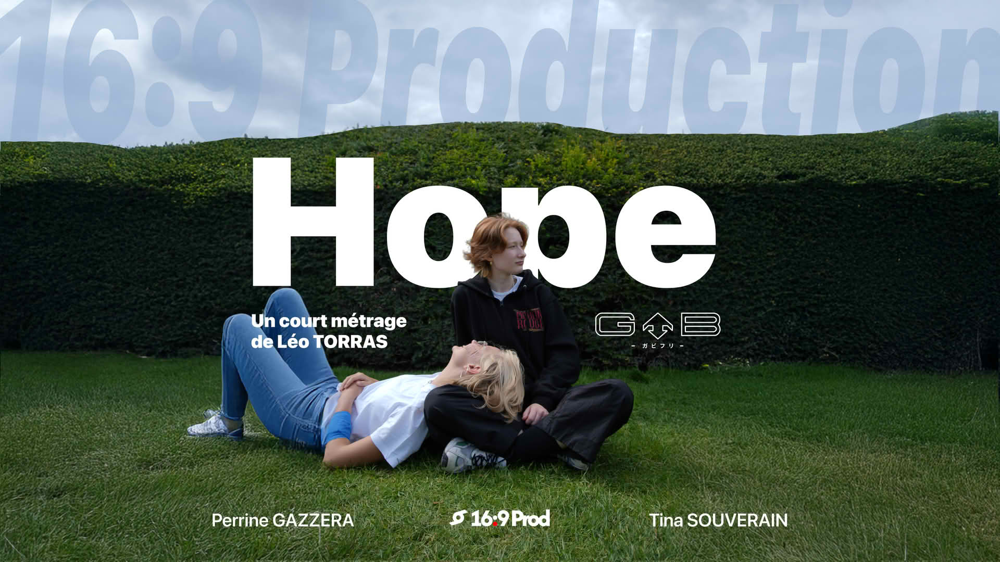

# 📼 16:9 Prod — Portfolio Interactif

> Un portfolio web immersif et interactif au style rétro VHS, conçu pour présenter des projets de réalisation vidéo, documentaires, podcasts et courts-métrages.

 *Remplacez ce chemin par un vrai screenshot global de votre site une fois en ligne*

## ✨ Fonctionnalités Clés

- 📽️ **Hero Section Horizontale** : Une introduction immersive pilotée par le scroll (effet de balayage latéral).
- 📼 **Lecteur VHS Interactif (Drag & Drop)** : La pièce maîtresse du portfolio. Naviguez dans la bibliothèque, attrapez une cassette et glissez-la physiquement dans le magnétoscope pour lancer le projet. 
- 🔴 **Ambiance Dynamique** : Les effets lumineux et les couleurs du lecteur s'adaptent dynamiquement via JavaScript selon le type de contenu inséré (Court-métrage, Docu, Podcast, Vlog).
- 🎬 **L'envers du décor** : Un slider "Making-of" organisé sous forme de boucle infinie avec un masque d'écrêtage interactif (curseur Avant/Après).
- 📱 **100% Responsive** : Une architecture hybride pointue exploitant **CSS Grid** et **Flexbox** pour garantir une expérience tactile fluide (swipe horizontal, glisser-déposer sans coupure) sur tous les appareils mobiles.

## 🛠️ Technologies Utilisées

Ce projet est construit sans framework lourd, en misant sur la performance et l'animation pure :

- **HTML5 / CSS3** : Architecture sémantique, CSS Grid, Variables CSS, effet Glassmorphism et animations Keyframes.
- **JavaScript (Vanilla)** : Logique des modales, manipulation du DOM et gestion dynamique du lecteur YouTube.
- **GSAP (GreenSock)** : Moteur d'animation principal du site.
  - *ScrollTrigger* : Pour gérer l'animation horizontale au scroll.
  - *Draggable* : Pour la mécanique de glisser-déposer des cassettes et du slider making-of.
  - *ScrollToPlugin* : Pour la navigation ancrée fluide.

  Ton portfolio mérite une belle vitrine sur GitHub pour mettre en valeur tout le travail technique (notamment avec GSAP) et créatif accompli. Voici un fichier `README.md` complet, structuré et visuellement agréable, prêt à être copié-collé à la racine de ton projet :

## 📁 Structure du projet

```text
📂 16-9-prod/
├── 📄 index.html        # Point d'entrée principal
├── 📄 style.css         # Styles, Responsive Grid/Flexbox & Design
├── 📂 JS/               
│   ├── 📄 main.js       # Logique d'animation GSAP et événements
│   └── 📂 GSAP/         # Librairies GreenSock hébergées localement
└── 📂 assets/           # Médias (Affiches, Cassettes, Making-off, Branding)

```

## 👨‍💻 À propos

**Léo Torras**

*Fondateur de 16:9 Production & Étudiant en gestion de projet digital*

Création de vidéos, réalisation de courts-métrages et développement d'expériences interactives.